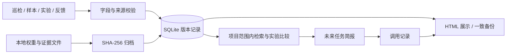

# 道路病害科研长期记忆 Skill

[](https://github.com/FreeLiiives/road-disease-memory-skill/actions/workflows/ci.yml)

**保存研究证据、找回模型权重、复用历史案例，并展示跨任务调用记录。**

面向道路病害识别与养护研究，提供可安装的 Codex Skill 和独立 Python CLI。采用本地 SQLite、不可原位覆盖的记录版本、按 SHA-256 归档的附件和明确的实验比较条件。Python 3.10+，不需要 GPU、API Key、向量数据库或第三方 Python 包。

## 功能范围

| 模块 | 已实现能力 |
| --- | --- |
| 历史巡检与病害样本 | 项目、路段、病害、发生时间、来源和结构化补充信息 |
| 诊断依据与建议 | 事实/假设的核验状态、依据摘要、显式矛盾关系 |
| 规范记忆 | 保存引用与核对信息；有效性需重新查证 |
| 模型实验 | 相同数据与评估条件下比较指标，保留并列最优 |
| 权重归档 | 复制保存、内容去重、SHA-256 校验、损坏/缺失检测 |
| 养护反馈 | 将后续记录与历史建议、诊断建立可追踪关系 |
| 跨任务调用 | 生成记忆简报，保存所返回的具体记录版本 ID |
| 展示与恢复 | 本地 HTML 看板、历史修订、数据库及附件一致备份 |

这是一套**外部持久记忆**，不改变大模型参数，不读取所有聊天，也不会自动从历史对话中猜测模型成绩。不同任务使用同一存储目录，才能共享记忆。未接入语义向量检索，当前采用关键词和结构化筛选。

## 3 分钟运行演示

```powershell
git clone https://github.com/FreeLiiives/road-disease-memory-skill.git
cd road-disease-memory-skill
python scripts/demo.py --output local-data/demo
```

打开 `local-data/demo/dashboard.html`，查看 8 条模拟科研记录、2 次任务调用及证据关系。`comparison.json` 展示同条件模型比较结果，`backup` 可直接作为存储目录读取。

**全部演示记录、指标和权重占位文本均为模拟数据，不是你的训练结果，也不是可加载的模型。** 重跑请换新的 output 目录，避免覆盖旧演示。

## 安装 Skill

```powershell
python scripts/install_skill.py
```

安装到 `$CODEX_HOME/skills/road-disease-memory`；未设置 CODEX_HOME 时使用 `~/.codex/skills/road-disease-memory`。已有同名目录时停止。新会话输入：

```text
$road-disease-memory 为我的道路病害课题建立记忆库，保存这次实验的指标、评估条件和权重；下次任务先检索相关历史记录。
```

Skill 本体见 [SKILL.md](skills/road-disease-memory/SKILL.md)。默认数据保存在 `~/.road-disease-memory`，不在技能代码目录。通过环境变量 `ROAD_MEMORY_HOME` 或 CLI 的 `--store` 改为你选定的路径。复制 Skill 不会自动搬迁数据库；备份必须包含数据库和 objects 附件目录。

## 独立命令行使用

以下命令在仓库根目录执行。Windows 可将 python 换成 `py -3` 或你的 Python 完整路径。

```powershell
# 创建演示用途的独立存储
python skills/road-disease-memory/scripts/memory.py --store local-data/my-memory init
# 写入示例记录，返回唯一 ID
python skills/road-disease-memory/scripts/memory.py --store local-data/my-memory add --file examples/inspection.json
# 检索同一项目中的坑槽记录
python skills/road-disease-memory/scripts/memory.py --store local-data/my-memory recall --project example-project --query 坑槽
# 生成未来任务简报，同时记录这次调用
python skills/road-disease-memory/scripts/memory.py --store local-data/my-memory brief --project example-project --task "后续巡检准备" --query 坑槽
# 本地展示
python skills/road-disease-memory/scripts/memory.py --store local-data/my-memory dashboard --project example-project --output local-data/my-dashboard.html
# 校验及备份（目标必须不存在）
python skills/road-disease-memory/scripts/memory.py --store local-data/my-memory audit
python skills/road-disease-memory/scripts/memory.py --store local-data/my-memory backup --to local-data/my-backup
# 从备份读取，验证恢复能力
python skills/road-disease-memory/scripts/memory.py --store local-data/my-backup recall --project example-project
```

`add --supersedes ID` 创建修订版本；`get ID` 查看证据、附件、关系和新旧版本关联。默认检索排除已被替代/已否定的记录；`--history` 可查看完整历史。命令失败返回 2，输出 JSON 错误。

## “最好的模型”如何定义

实验记录必须写明真实的评估数据清单哈希、类别表哈希、划分、图像尺寸与评估协议。`best` 只比较 comparison 对象完全一致且标为 verified 的有效版本：

```powershell
python skills/road-disease-memory/scripts/memory.py --store YOUR_STORE best --project PROJECT --reference EXPERIMENT_ID --metric map50_95 --direction max
python skills/road-disease-memory/scripts/memory.py --store YOUR_STORE attach EXPERIMENT_ID --file PATH_TO_BEST_PT --role weights --note "该权重经某次评估得到此记录中的指标，评估报告路径为……"
```

命令中的大写项需要替换为真实路径/ID。没有归档权重时不会声称“权重可用”；即使分数最好，仍会报告附件缺失或哈希异常。程序不加载 `.pt`，不进行模型推理。评估报告必须实际对应该权重，不能把日志最佳轮次的指标直接归给未知 checkpoint。

记录格式、比较条件、版本语义见 [记录协议](skills/road-disease-memory/references/record-contract.md)。程序可验证字段和文件完整性，但不能替研究者证明结果真实。

## 架构与数据边界



发布仓库只包含原创代码、说明和模拟示例；真实记忆数据库、巡检图片、位置、实验报告和权重留在本机。HTML 看板是本地快照，也可能含真实资料，不应未经授权公开。默认没有自动云同步、加密或多用户鉴权；适合个人科研原型。附件归档会占用相应磁盘空间。

与 [道路养护规范 Skill](https://github.com/FreeLiiives/road-maintenance-standards-skill) 的分工：规范 Skill 查公告和版本；本 Skill 保存某次引用、实验及决策依据。旧记忆不能直接证明规范今天仍有效。

## 验证与许可

```powershell
python -m unittest discover -s tests -v
```

测试覆盖重开数据库、中文检索、项目隔离、修订冲突、已否定记录、指标单位、不可比较实验、并列最优、权重源文件删除、归档损坏、备份重开、矛盾关系、任务版本索引和 HTML 转义。GitHub Actions 在 Windows/Ubuntu、Python 3.10/3.12 上执行测试与演示。

原创代码和说明采用 [MIT License](LICENSE)。本项目未宣称复现特定论文，也不提供模型精度提升或工程诊断正确性的保证。
